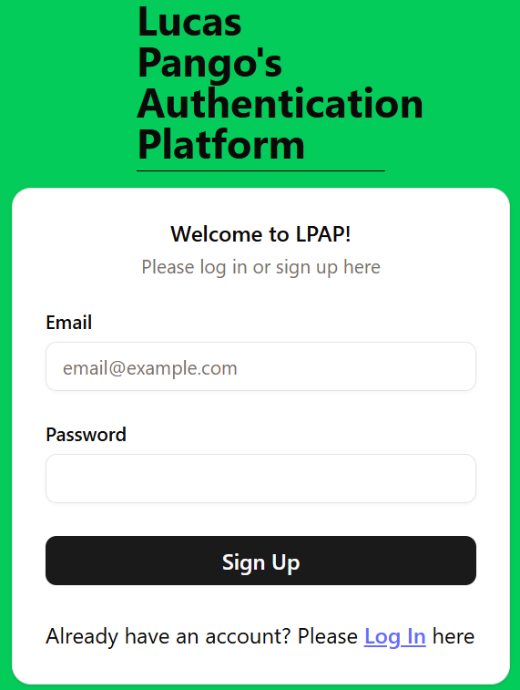
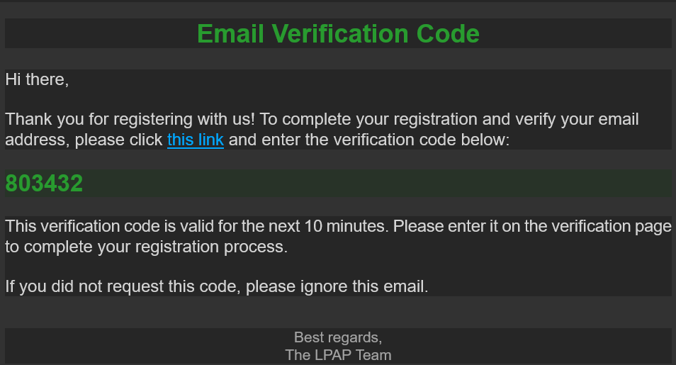
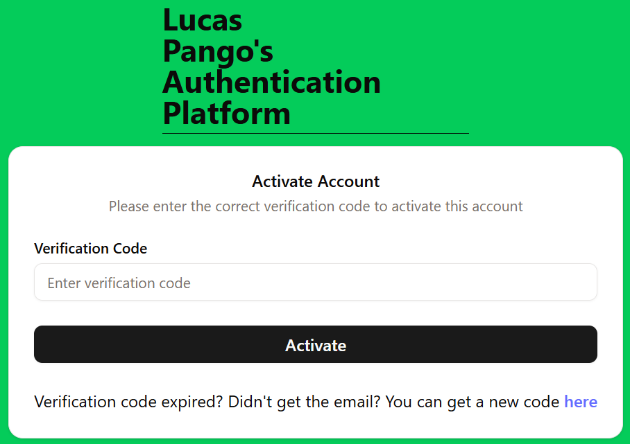
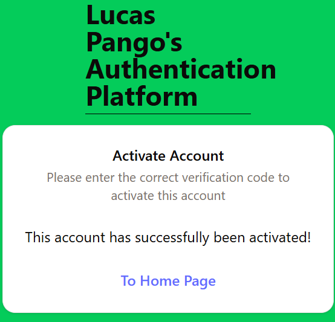

# Lucas Pango's Authentication Platform

## About

Lucas Pango's Authentication Platform (aka **LPAP**) serves as an authentication manager for all of my future personal projects, centralising all authentication and user details instead of having to make new accounts for every new project.

This app comes built with a simple frontend application that interacts with the backend authentication endpoints.

### Tech Stack

- [**PostgreSQL**](https://www.postgresql.org/) for the database
- [**Spring Boot**](https://spring.io/) with **Maven** for the backend API
- [**React**](https://react.dev/) frontend build with [**Vite**](https://vite.dev/)

### Languages Used

- Java
- JavaScript / Typescript
- HTML
- CSS

## SWE Principles & Practices Covered

_A non-exhaustive list of the concepts learnt while developing this application:_

- JWTs
  - Access Tokens
  - Refresh Tokens
  - Issuing / Invalidating tokens
- Security
  - Verifying JWTs using a private key
  - Storing access tokens in memory _(i.e. in a React Context)_
  - Storing refresh tokens in http-only cookies
  - CORS
    - Using a reverse proxy to prevent CORS issues that prevents refresh token being stored

## Web App Demonstration

When a the user goes to the home page, they are met with a minimal home page with a button to log in:

When the user clicks the **Log In** button, they are then presented with the log in / sign up page where they can do their respective action:

When the user signs up for the first time with their email and password they get the following email with a link to verify their account and verification code to enter to complete the verification process:

When the user clicks the link in the email they are taken to a page to enter their code. The user also has the option to get a new code generated and resent in the case that their verification code has expired:

Once activated, the user can now go back to the home page which now allows the user to log out:

When the user click "Log out", the page changes back the first screenshot.

This web app implements refresh tokens, which allows new access tokens to be created to allows users to stay logged in even after refreshing the page.

## Current Limitations

- At this current stage, the web application only allows the user to be logged in on one device at a time due to only one refresh token being allowed per session
  - This is due to refresh tokens being stored in the database, which makes them stateful, and all active refresh tokens are disabled when a user logs in / logs out
  - This can be improved by allowing more 1 active refresh token per user in the database or simply making refresh tokens stateless
  - Making tokens stateless will reduce database usage but will also create security concerns in the case that a hacker gets access to a refresh token
- It is not known exactly how the backend would behave in the case that multiple endpoints are rejected at the same time, leading to multiple calls to the refresh token endpoint and potentially causing race conditions
  - This is not an issue at the moment due to no simultaneous calls but is worth considering

## Things To Add

- Allowing one user to log in on multiple devices
  - Also allowing user to log out on all devices
- Implementing "Trust This Device" functionality
  - Simply increases the duration of the refresh token
- Implementing OAuth
- Creating a finished home page
- Creating a profile page for users to view / edit profile details
- Role-Based Authorisation
